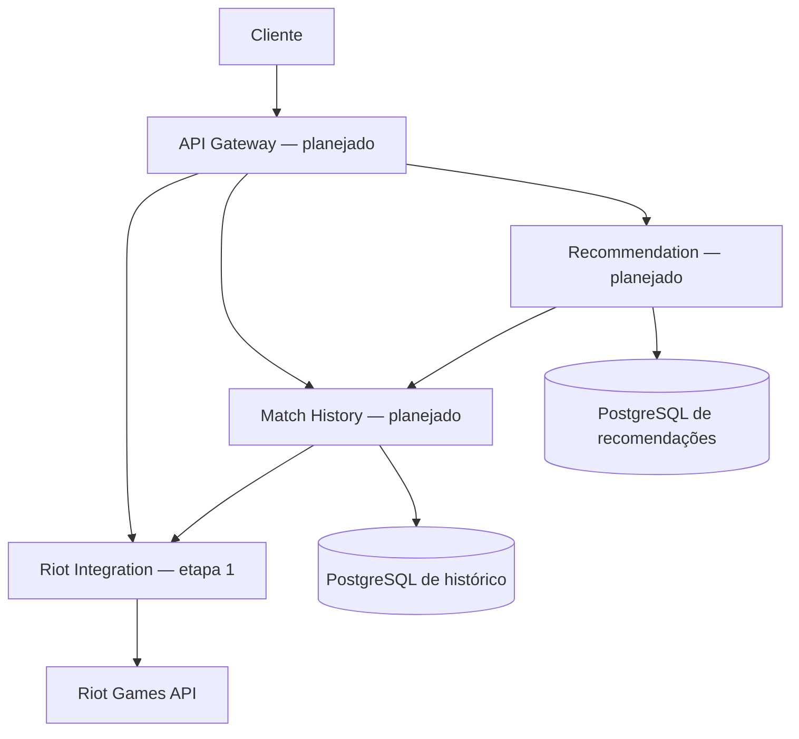

# LoL Portfolio — Python

Sistema de recomendação de campeões de League of Legends, desenvolvido em etapas
para aprendizado e portfólio. **Etapa 1 implementada: integração com ACCOUNT-V1.**
Ainda não calcula estatísticas nem recomenda campeões.

## Executar no Windows (PowerShell)

Requer Python 3.12 ou superior. Abra o terminal na pasta deste README:

```powershell
cd riot-integration-service
python -m venv .venv
.\.venv\Scripts\python.exe -m pip install -e ".[dev]"
Copy-Item .env.example .env
notepad .env
```

Preencha `RIOT_API_KEY` no arquivo `.env` com sua chave obtida no
[portal da Riot](https://developer.riotgames.com/). Não envie a chave pelo chat.
O `.env` é ignorado pelo Git e pelo build Docker. Variáveis do processo têm
precedência sobre o arquivo. Execute a partir de `riot-integration-service`,
pois o carregamento de `.env` é relativo ao diretório atual.

```powershell
.\.venv\Scripts\python.exe -m uvicorn riot_integration.main:app --reload --no-access-log
```

Abra [Swagger UI](http://127.0.0.1:8000/docs) e execute
`GET /api/v1/accounts/by-riot-id`, preenchendo `gameName` e `tagLine` separadamente,
sem incluir `#`. O exemplo abaixo é ilustrativo; use um Riot ID existente:

```powershell
Invoke-RestMethod 'http://127.0.0.1:8000/api/v1/accounts/by-riot-id?gameName=Meu%20Jogador&tagLine=BR1'
```

Resposta ilustrativa:

```json
{"puuid": "identificador-da-conta", "gameName": "Meu Jogador", "tagLine": "BR1"}
```

O endpoint retorna a **conta Riot**, não nível de invocador, elo ou histórico.
O PUUID permite consultar dados de LoL nas próximas etapas. `RIOT_REGION=americas`
é o padrão para este exemplo. A região de roteamento é configuração do servidor,
não é deduzida da tag. Nomes podem ser omitidos pela API e então retornam `null`.

Sem chave, `/health` e `/docs` funcionam, mas a consulta retorna 503.
`/health` indica que o processo está vivo; não valida a chave nem consulta a Riot.

## Docker

Com Docker instalado e em execução, crie/preencha o `.env` como acima e execute
na pasta deste README:

```powershell
docker compose up --build
```

O serviço fica em `http://127.0.0.1:8000`. Para encerrar:
`docker compose down`. O Compose desta etapa sobe somente a integração.

## Testes e qualidade

Na pasta `riot-integration-service`, com as dependências de desenvolvimento instaladas:

```powershell
.\.venv\Scripts\python.exe -m pytest -q
.\.venv\Scripts\python.exe -m ruff check .
```

Os testes interceptam as chamadas HTTP com `httpx.MockTransport`: não precisam
de chave nem consomem a cota da Riot. Cobrem contrato HTTP, encoding, autenticação
externa, dados inválidos, 404, 429, cooldown, recuperação, timeout e retries limitados.
Isso verifica nosso comportamento simulado, não a disponibilidade da API real.

## Arquitetura e evolução



Por enquanto, o cliente acessa a integração diretamente. Os outros serviços
serão adicionados ao monorepo quando as próximas etapas forem implementadas.
Cada serviço terá seu próprio `pyproject.toml`, imagem e dependências.

| No projeto Java | Adaptação para Python | Situação |
| --- | --- | --- |
| Spring Boot / Springdoc | FastAPI / OpenAPI automático | Implementado |
| Maven ou Gradle | pyproject.toml + pip + venv | Implementado |
| DTOs / MapStruct | Modelos Pydantic | Implementado |
| OpenFeign | HTTPX assíncrono | Implementado na integração |
| Resilience4j | Retry limitado + cooldown de 429 | Parcial; circuit breaker futuro |
| JUnit / WireMock | pytest / HTTPX MockTransport | Implementado |
| Spring Data JPA | SQLAlchemy + PostgreSQL | Planejado |
| Flyway | Alembic | Planejado |
| Spring Cloud Gateway | Gateway HTTP, escolha na etapa 4 | Planejado |
| Caffeine | Cache com TTL | Planejado |
| Spring Security / JWT | Autenticação no gateway | Planejado |

FastAPI valida a entrada e documenta o contrato. HTTPX usa `async/await` para
esperar I/O sem bloquear o event loop. Uma conexão reutilizável é aberta no
`lifespan` e fechada ao encerrar. O cliente Riot é um **Adapter**: traduz HTTP e
falhas externas para modelos e erros internos, sem depender do FastAPI.
Injetar o transporte, relógio e espera permite testar sem rede ou espera real.

`pyproject.toml` reúne metadados e dependências, sem precisar escolher Maven ou
Gradle. As faixas de versões estão limitadas por versão principal; ainda não há
lockfile, portanto instalações futuras podem resolver versões diferentes.

## Falhas e limites

| Situação | Resposta local | Comportamento |
| --- | --- | --- |
| Entrada inválida | 422 | Não chama a Riot |
| Conta ausente | 404 | Não repete |
| Chave ausente ou Riot 401/403 | 503 | Orienta verificar configuração; não repete |
| Riot 429 | 429 + Retry-After | Bloqueia novas chamadas pelo intervalo indicado |
| Riot 5xx ou erro de conexão | 502 | Até 3 tentativas, esperas de 0,5 e 1 segundo |
| Timeout | 504 | Mesmo limite de tentativas |
| Corpo de sucesso inválido | 502 | Não expõe resposta bruta |

O timeout padrão de 5 segundos se aplica às operações de rede do HTTPX; não é
um prazo total para todas as tentativas ou para espera na fila. O cooldown usa
120 segundos se `Retry-After` estiver ausente ou inválido. Nesta etapa, as chamadas
externas são serializadas para que a próxima observe um 429 já recebido.
O bloqueio é local ao processo: execute com **um worker e uma instância**.
Antes de escalar, implemente coordenação de limites em Redis, fila limitada e
controle preventivo pelos cabeçalhos de cota. Ainda não há circuit breaker ou cache.

Development keys expiram a cada 24 horas; renove no portal e reinicie o serviço
após atualizar a configuração. As cotas podem variar: não trate um valor fixo
como garantia. A chave só é enviada no header `X-Riot-Token`, nunca na URL.
Respostas de erro não repassam corpos ou exceções brutas da Riot.

## Próximas etapas de aprendizado

1. Validar esta consulta localmente com sua chave e entender `main.py`,
   `client.py`, `config.py` e os testes.
2. Ampliar a integração com Match-V5 e Data Dragon, cache e circuit breaker.
3. Criar `match-history-service/` com PostgreSQL, SQLAlchemy e migrações Alembic;
   buscar partidas por HTTP, persistir sem duplicação e agregar winrate/KDA/role.
4. Criar `recommendation-service/`: baseline explicável com tamanho mínimo de
   amostra, afinidade de role e estilo; avaliar a qualidade das recomendações.
5. Criar `api-gateway/`, ampliar Compose, testes de integração e depois JWT.

Microserviços aqui são uma escolha didática para demonstrar limites e comunicação.
Para um produto pequeno, um monólito modular também seria adequado e teria menos
custo operacional. Banco por serviço evita que um serviço dependa de tabelas de outro.

## Referências

- [Riot: ACCOUNT-V1 e Riot ID](https://developer.riotgames.com/docs/lol)
- [Riot: chaves, códigos HTTP e rate limits](https://developer.riotgames.com/docs/portal)
- [FastAPI: testes](https://fastapi.tiangolo.com/tutorial/testing/)

Projeto educacional independente, sem afiliação com a Riot Games.
