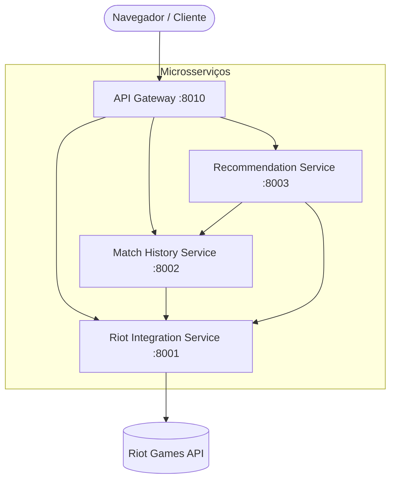

# 🧭 Rift Compass — League of Legends Tactical Analytics

Plataforma inteligente de análise tática, recomendação de campeões e cálculo de curvas de aprendizado para **League of Legends**, integrando dados oficiais da **Riot Games API** através de uma arquitetura de microsserviços em Python e interface moderna construída com GSAP.

---

## 🎯 Proposta do Projeto

Diferente de tier lists genéricas da internet, o **Rift Compass** resolve dois problemas essenciais para jogadores competitivos:

1. **Recomendação com Afinidade Real:** Avalia o histórico recente ranqueado do invocador (rotas preferenciais, distribuição de classes e consistência estatística) para sugerir novos campeões que convergem com o estilo individual do jogador.
2. **Curva de Aprendizado e Inflexão de Winrate:** Em vez de pontuações de dificuldade estáticas ou subjetivas, o sistema calcula a curva de evolução da taxa de vitória por volume de partidas para cada um dos 173 campeões:
   - **Taxa de Estreia (1 a 5 jogos):** Desempenho inicial de novos jogadores com o campeão.
   - **Ponto de Inflexão:** O número médio de partidas necessárias para que o winrate do jogador **comece a aumentar** de forma consistente.
   - **Domínio Tático (55% WR):** Patamar de consistência mecânica, conhecimento de confrontos e alto impacto.
   - **Teto de Desempenho (60%+ WR):** Desempenho máximo alcançado por mono-champions e especialistas dedicados.

---

## 🏗️ Arquitetura do Sistema

O projeto é estruturado em uma arquitetura limpa de **microsserviços assíncronos**:



### Serviços

- **API Gateway (`api-gateway`):** Ponto único de entrada, rate limiting, segurança de headers HTTP (CSP, HSTS), autenticação de sessão e distribuição de arquivos estáticos.
- **Riot Integration (`riot-integration-service`):** Cliente HTTP assíncrono com tratamento de erros, cache resiliente e cálculo individual da curva de evolução de winrate para todos os 173 campeões.
- **Match History (`match-history-service`):** Processamento e normalização das últimas partidas ranqueadas (KDA, CS/min, dano, visão, taxa de vitória).
- **Recommendation Engine (`recommendation-service`):** Algoritmo heurístico de afinidade combinando posição (45%), classes jogadas (25%) e desempenho correlacionado (30%).
- **Frontend SPA (`api-gateway/static`):** Interface dinâmica em vanilla JavaScript moderno com microinterações fluidas utilizando **GSAP** (GreenSock Animation Platform) e estética visual inspirada na tecnologia Hextech de Runeterra.

---

## 🚀 Como Executar

### Pré-requisitos
- Python 3.12+ (ou Docker)
- Chave de API da Riot Games (opcional para o modo Demonstração; obrigatória para consultas ao vivo obtida no [Riot Developer Portal](https://developer.riotgames.com/)).

### 1. Executando Localmente (Recomendado)

Abra o terminal na pasta raiz do projeto:

```powershell
# 1. Crie e ative o ambiente virtual
python -m venv .venv
.\.venv\Scripts\Activate.ps1

# 2. Instale os módulos do projeto
pip install -r requirements.txt

# 3. Configure as variáveis de ambiente
Copy-Item .env.example .env
# (Opcional: edite o .env para adicionar sua RIOT_API_KEY)

# 4. Inicie todos os serviços simultaneamente
python run.py
```

Acesse no navegador: **[http://127.0.0.1:8010](http://127.0.0.1:8010)**

> 💡 **Dica:** Clique no botão **"Ver Demonstração Interativa"** para carregar instantaneamente um perfil completo com 20 partidas simuladas, gráficos bento e recomendações sem precisar de uma chave da Riot.

---

### 2. Executando via Docker Compose

```bash
# Copie o arquivo de configuração
cp .env.example .env

# Suba todos os contêineres
docker compose up --build
```

A aplicação estará disponível em `http://127.0.0.1:8010`.

---

## 🛠️ Tecnologias Utilizadas

- **Linguagem:** Python 3.12+
- **Framework Web:** FastAPI, Uvicorn, Starlette
- **Validação de Dados:** Pydantic v2 & Pydantic-Settings
- **Cliente HTTP:** HTTPX (assíncrono)
- **Banco de Dados:** SQLite com SQLAlchemy 2.0 & Alembic
- **Frontend:** HTML5, CSS3 moderno (Custom Properties, Grid/Flexbox), JavaScript ES6+
- **Animações:** GSAP (GreenSock Animation Platform)
- **Containerização:** Docker & Docker Compose

---

## ⚖️ Licença e Disclaimer

Este projeto não é afiliado, associado, autorizado ou endossado pela Riot Games. League of Legends e todas as propriedades intelectuais associadas são marcas registradas da Riot Games, Inc.
